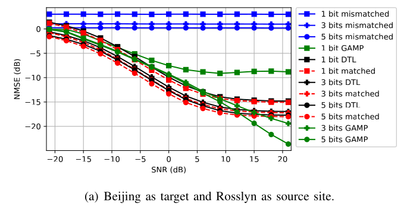

# Paper

Tensorflow implementation of [Deep Transfer Learning for Site-Specific Channel
Estimation in Low-Resolution mmWave MIMO](https://ieeexplore.ieee.org/document/9388873)

*Abstract* — We consider the problem of channel estimation in
low-resolution multiple-input multiple-output (MIMO) systems
operating at millimeter wave (mmWave) and present a deep
transfer learning (DTL) approach that exploits previously trained
models to speed up site adaptation. The proposed model is
composed of a feature extractor and a regressor, with only the
regressor requiring training for the new environment. The DTL
approach is evaluated using two 3D scenarios where ray-tracing
is performed to generate the mmWave MIMO channels used in
the simulations. Under the defined testing setup, the proposed
DTL approach can reduce the computational cost of the training
stage without decreasing the estimation accuracy.

# Usage

# Directory description

Filename   | Description
--------- | ------
wr_fres.py | main file to train models
pretrained_model.py | apply deep transfer learning in trained models
mimo_channels.py | base file to generate mimo channels
mimo_channels_data_generator.py | this file generates data for the model training
utils.py | contains models architecture

# Datasets
